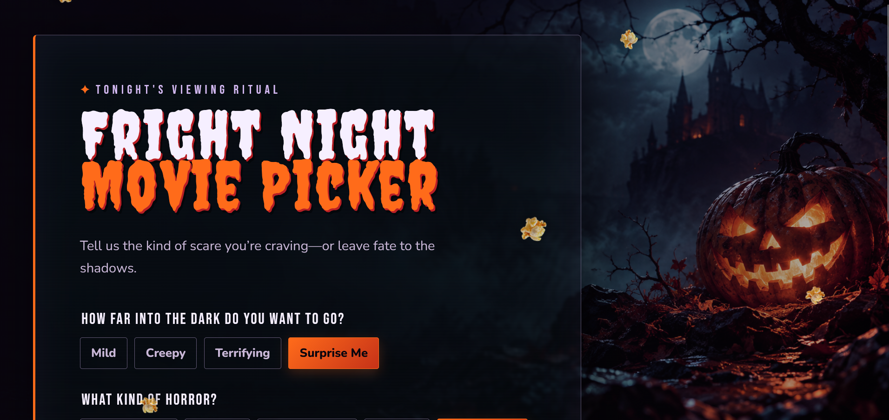

# Fright Night Movie Picker



## Live demo

[**Click to view live demo**](https://fright-night-movie-picker.vercel.app/)

Fright Night Movie Picker is a Halloween-themed horror movie recommender powered by [The Movie Database (TMDB)](https://www.themoviedb.org/). Choose the kind of scare you want, or let fate choose a film for you. Recommendations are presented as a theatrical ticket, with a dedicated horror-only Top 10 page for browsing.

## Features

- Filter recommendations by scare level: Mild, Creepy, Terrifying, or Surprise Me.
- Choose a horror style, including supernatural, slasher, psychological, thriller, or a random selection.
- Filter by release era: classic, 1980s–1990s, modern, or any era.
- Filter by TMDB rating bands: 0–5, 6–7, 8–10, or Surprise Me.
- Use **Just Scare Me** to generate a random horror recommendation without choosing filters.
- View each recommendation on a vintage movie-ticket result page with its poster, title, year, genres, TMDB rating, synopsis, and Fright Night scare factor.
- Browse a horror-only Top 10 list ranked by TMDB rating.
- Receive friendly messages for no results, API failures, network interruptions, and missing movie data.
- Enjoy responsive layouts, falling popcorn, Halloween typography, and reduced-motion support.

## How it works

The browser sends requests to the app's same-origin `/api/tmdb` Vercel Function. The function securely calls TMDB using a server-side environment variable, so the TMDB credential is never exposed in client-side JavaScript.

## Deploy on Vercel

1. Import this GitHub repository into Vercel.
2. In **Project Settings → Environment Variables**, add the following secret for both **Production** and **Preview**:

   ```text
   TMDB_READ_ACCESS_TOKEN=your-tmdb-api-read-access-token
   ```

   The TMDB API Read Access Token is preferred. Alternatively, use a v3 API key:

   ```text
   TMDB_API_KEY=your-tmdb-v3-api-key
   ```

3. Save the variable and redeploy the project. Environment variable changes only apply to new deployments.
4. Open the new deployment and test a recommendation, the ticket page, and the Top 10 page.

Never commit `.env.local`, API keys, or read access tokens to the repository.

## Run locally

1. Install [Node.js](https://nodejs.org/) and the Vercel CLI.
2. Copy `.env.example` to `.env.local`.
3. Add either your TMDB Read Access Token or v3 API key to `.env.local`.
4. Start the local Vercel runtime:

   ```powershell
   npx vercel dev
   ```

5. Open the local URL shown in the terminal, usually `http://localhost:3000`.

## Project structure

```text
fright-night-movie-picker/
├── api/tmdb.mjs            # Vercel Function; private TMDB proxy
├── assets/                 # Background, popcorn, favicon, and preview artwork
├── .env.example            # Safe environment variable template
├── index.html              # Preference picker landing page
├── movie.html              # Movie-ticket result page
├── top10.html              # Horror-only Top 10 page
├── script.js               # Picker filters and recommendation flow
├── movie.js                # Ticket-page rendering
├── top10.js                # Top 10 data loading and rendering
├── styles.css              # Landing page theme and responsive styles
├── movie.css               # Ticket-page theme
├── top10.css               # Top 10 page theme
├── scope.md                # Scope and MVP plan
└── prompts.md              # Development prompt log
```

## Testing notes

- Test every scare level, horror style, era, and TMDB rating band.
- Use **Just Scare Me** multiple times and confirm that recommendations vary.
- Confirm the ticket and Top 10 pages load movie details and posters.
- Test a restrictive combination to confirm the no-results message.
- Use browser DevTools → Network → Offline to verify the network error message.
- Test missing posters, synopsis, rating, and genre data.
- Test invalid server-side TMDB credentials through a Preview deployment.
- Check narrow screens and reduced-motion settings.

## Documentation

- [Scope and MVP plan](scope.md)
- [Prompt log](prompts.md)

## Credits

This product uses the TMDB API but is not endorsed or certified by TMDB. Movie data and poster images are provided by TMDB.

## Author

Kendra A. Hartnett · GitHub: [@kendrahartnett](https://github.com/kendrahartnett)

